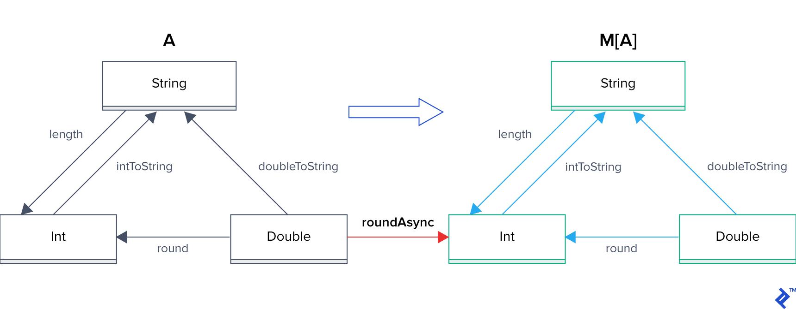

# Functional programing

## Category Theory
1. O tipo é exatamente como o vemos em linguagens com tipagem estática. Exemplos: Int, String, Dog, Cat, etc.
2. Funções conectam 2 tipos $f: T \to U$. fução recebe um argumento do tipo $T$ e retorna o tipo $U$

## Pure functions
determinística. Uma saida para uma etrada específica e não alteram estados. se resumem em seu escopo 

## Composition
Composição é uma operação denotada pelo Operador $\cdot$, que constroi novas funções a partir de outras. Em uma categoria é sempre garantido que para qualquer função $f$: $T$ $\to$ $U$ e $g$: $U$ $\to$ $V$, existe uma única função $h$: $T$ $\to$ $V$, denotada como $f$ $\cdot$ $g$
ex(typescript):
```ts
type MathFuncOneParam = (x: number) => number
type MathFuncCompose = (...args:MathFuncOneParam[]) => MathFuncOneParam


const add5:MathFuncOneParam = (x) => x + 5
const double:MathFuncOneParam = (x) => x * 2

const compose:MathFuncCompose = (f1, f2) => (x) => f2(f1(x))

const app = compose(add5, double);
console.log(app(3))
// >> 16
```
ex(dart):
```dart
typedef MathFunctionOneParam = int Function(int);
typedef MathFunctionOneParamCompose = MathFunctionOneParam Function(
    MathFunctionOneParam, MathFunctionOneParam);

MathFunctionOneParam add5 = (x) => x + 5;
MathFunctionOneParam double = (x) => x * 2;

MathFunctionOneParamCompose compose = (fn1, fn2) {
  return (int x) => fn2(fn1(x));
};

void main(List<String> args) {
  final app = compose(add5, double);
  print(app(3));
}
// >> 16

```

podemos ainda criar uma função para compor dinamicamente quantas funções forem passadas:
ex (typescript):
```ts
const add5:MathFuncOneParam = (x) => x + 5
const double:MathFuncOneParam = (x) => x * 2
const deduct3:MathFuncOneParam =(x) => x - 3


const compose2: MathFuncCompose = (...funcs) => (x) => { // recebe um X parametros (usando rest operator)
	return funcs.reduce((acc, func) =>{
		return func(acc)
	}, x)
}

const app2 = compose2(add5, double, deduct3)

console.log(app2(5))
// >> 17
```

ex(dart):
```dart
typedef MathFunctionOneParam = int Function(int);
typedef MathFunctionOneParamComposeList = MathFunctionOneParam Function(
    List<MathFunctionOneParam>);

MathFunctionOneParam add5 = (x) => x + 5;
MathFunctionOneParam double = (x) => x * 2;
MathFunctionOneParam deduct3 = (x) => x - 3;

MathFunctionOneParamComposeList compose = (funcs) {
  return (int x) => funcs.fold(x, (acc, fn) => acc = fn(acc));
};

void main(List<String> args) {
  final app = compose([add5, double, deduct3]);
  print(app(5));
}
```

## Monadic Composition
Vamos chamar o comportamento instável como I/O de efeito colateral. Agora queremos poder trabalhar com todas as nossas funções definidas anteriormente, como `length` e tipos como `String`, de maneira estável na presença desse efeito colateral. Então, vamos começar com uma categoria vazia $M[A]$ e transformá-lo em uma categoria que terá valores com um determinado tipo de efeito colateral e também valores sem efeitos colaterais. Vamos supor que definimos esta categoria e ela está vazia. No momento, não há nada de útil que possamos fazer com ele, portanto, para torná-lo útil, seguiremos estas três etapas:



*Imagem retirada do das fontes descritas no final do documento(Todos direitos preservados)*

**Fontes**
* [Intro to Monadic Composition in Functional Programming](https://www.youtube.com/watch?v=dqzuVhQ85Sk) by [Bitovi](https://www.youtube.com/@Bitovi)
* [Option/Maybe, Either, and Future Monads in JavaScript, Python, Ruby, Swift, and Scala](https://www.toptal.com/javascript/option-maybe-either-future-monads-js) by [Alexey Karasev](https://www.toptal.com/resume/alexey-karasev)